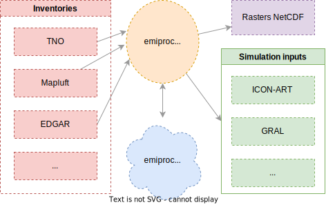

.. emiproc documentation master file, created by
   sphinx-quickstart on Mon Oct  3 10:41:41 2022.
   You can adapt this file completely to your liking, but it should at least
   contain the root `toctree` directive.

emiproc
=======

`emiproc` is a python package to generate emission input files for atmospheric 
transport models.

It can process inventories available in different formats and on different
grids and generate input files for models operating on any type of grid
including complex unstructured grids. Originally designed 
for the models COSMO-ART and ICON-ART, it can readily be adapted for other
models. 

A typical workflow is shown below:

* Read an inventory
* Perform some operations on it (for example: regridding, groupping categories, upsampling, ...)
* Export the inventory to a format that can be read by the model

Features 
--------

* Support multiple inventories such as EDGAR and TNO-CAMS
* Conservative spatial regridding
* Export to different formats (ICON-ART, COSMO-ART, NetCDF rasters)
* Merge inventories spatially around a region
* Separate handling of point sources if desired
* Group emission categories
* Speciation of emissions
* Visualization of the output
* Cyclic temporal profiles or time series of emissions

Contents 
--------

.. toctree::
   :maxdepth: 2

   installation
   inventories
   models
   tutos/tutorials
   emissions_generation
   profiles
   api/index
   contrib/contribute
   support
   bibliography

Indices and tables
------------------

* :ref:`genindex`
* :ref:`modindex`
* :ref:`search`
