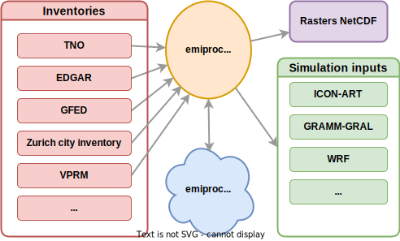

.. emiproc documentation master file, created by
   sphinx-quickstart on Mon Oct  3 10:41:41 2022.
   You can adapt this file completely to your liking, but it should at least
   contain the root `toctree` directive.

emiproc documentation
=====================

emiproc is a python package to generate emission input files for atmospheric 
transport models.

It can process inventories available in different formats and on different
grids and generate input files for models operating on any type of grid
including complex unstructured grids. Originally designed 
for the models COSMO-ART and ICON-ART, it can readily be adapted for other
models. 

A typical workflow is shown below:

* Read an inventory
* Perform some operations on it (e.g. regridding, merging categories, upsampling, ...)
* Export the inventory to a format that can be read by the model

Features 
--------

* Support of multiple inventories like EDGAR, TNO-CAMS
* Conservative spatial regridding
* Exporting to different formats (icon-art, cosmo-art, netcdf rasters)
* Spatially merging inventories around a region
* Separate handling of point sources if desired
* Categories/Substance selection
* Re-grouping of emission categories
* Visualization of the output
* Cyclic temporal profiles or time series of emissions

Contents 
--------

.. toctree::
   :maxdepth: 2

   installation
   tutos/tutorials
   inventories
   models
   emissions_generation
   profiles
   api/index
   support
   bibliography

Indices and tables
------------------

* :ref:`genindex`
* :ref:`modindex`
* :ref:`search`
