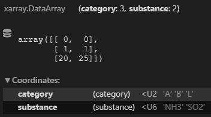

.. _profiles:

Emission Profiles
=================

Most of the inventories provide annual values for the emissions of a specific region.
For simulations we need to know how they vary with time and elevation.

For that we downscale the annual values using profiles.

The total emission :math:`E` is the sum of the emission for an emission source.
It is given in :math:`kg/year/source`.
Sources can be assigned profiles to describe how the emission varies with time and height.

We then can split the profiles in :math:`N` intervals of time or height. 

.. math::

    E = \sum_{i}^{N} E_i

Scaling factors vs Ratios 
-------------------------

There are two ways of describing the profiles:

1. Scaling factors
2. Ratios

Ratios signify the proportion of the total emission :math:`E`
that is emitted at a specific interval of time or height.

:math:`r_i` the ratio at index :math:`i`
we have 

.. math::
    
        \sum_{i}^{N} r_i = 1

        E_i = E * r_i

    
Scaling factor give a value for which we can multiply the average emmission
to get the emission at a specific time or height.

:math:`f_i` is the scaling factor at index :math:`i` 

.. math::

        \frac{\sum_{i}^{N} f_i}{N} = 1

        E_i = \frac{E * f_i}{N}

Based on these formulas, we can easily convert from one to the other.

.. math::

        f_i = N * r_i

        r_i = \frac{f_i}{N}

Ratios sum up to one.
Scaling factors have an average of one.

Emiproc stores internally ratios for the profiles, but uses and exports sometimes
scaling factors.

scaling factors have the advantage that you can easily use them to combine profiles 
together.

.. _vertical_profiles:

Vertical Profiles 
-----------------

Vertical profiles in emiproc are handled by the class
:py:class:`~emiproc.profiles.vertical_profiles.VerticalProfile`

Each inventory is assigned a set of profile, which can be attributed
to a specific substance, category, gridcell or time .

Depending on how the data is gathered, different emission sources will
have different profiles. In exemple a powerplant will emit at just one height.

When applying operations (regridding, groupping, ...) on the inventories,
the profiles might need to be changed as well.

Vertical data in emiproc is always the height over the ground.

.. _temporal_profiles:

Temporal Profiles
-----------------

Fundamentally there are 2 ways of defining the time profile.

1. Deterministic
2. Periodic 

Either you have an emission factor at a each time, creating a time serie for 
the emission.

Or you have periodic patterns that define patterns of behaviour
(hour of day, day of week, mounth of year)

Creating profiles
-----------------

To create the profiles, emiproc gives you some helper functions available 
:ref:`in the API <profiles_api>` .

A notebook is also available :
`profiles.ipynb <https://github.com/C2SM-RCM/emiproc/blob/master/examples/profiles.ipynb>`_

Profiles in inventories
-----------------------

This chapter explains the format of the profiles in the inventories.
The next chapter will explain how to assign the profiles to emissions.

In the inventory, the profiles will be stored as a 
:py:class:`~emiproc.profiles.vertical_profiles.VerticalProfiles` for vertical profiles.
This class is assigned to the `v_profiles` attribute of the inventory.

The temporal profiles are stored as a list of list of :py:class:`~emiproc.profiles.temporal.profiles.TemporalProfile`.
They are assinged to the `t_profiles_groups` attribute of the inventory.

Each element of the main list is a list containing different types of 
temporal profiles object. We call this a group of temporal profiles.

.. code-block:: python

    # example of temporal profiles
    t_profiles_groups = [    
        # profile 0
        [
            WeeklyProfile(size=7, ratios=array([0.15, 0.15, 0.15, 0.15, 0.15, 0.12, 0.12])),
            DailyProfile(size=24, ratios=array([0.03, 0.03, 0.03, 0.03, 0.03, 0.03, 0.04, 0.04, 0.05, 0.05,
                                            0.05, 0.05, 0.05, 0.05, 0.05, 0.05, 0.05, 0.04, 0.04, 0.04,
                                            0.04, 0.04, 0.04, 0.04])),
            MounthsProfile(size=12, ratios=array([0.1 , 0.1 , 0.09, 0.08, 0.08, 0.07, 0.07, 0.07, 0.08, 0.08,
                                            0.09, 0.1 ]))
        ],
        # profile 1
        [
            WeeklyProfile(size=7, ratios=array([0.15, 0.15, 0.15, 0.15, 0.15, 0.11, 0.11])),
            DailyProfile(size=24, ratios=array([0.03, 0.03, 0.03, 0.03, 0.04, 0.04, 0.04, 0.04, 0.05, 0.05,
                                            0.05, 0.05, 0.05, 0.05, 0.05, 0.05, 0.04, 0.04, 0.04, 0.04,
                                            0.04, 0.03, 0.03, 0.03])),
            MounthsProfile(size=12, ratios=array([0.09, 0.09, 0.09, 0.08, 0.08, 0.07, 0.08, 0.08, 0.08, 0.08,
                                            0.09, 0.09]))
        ],
        # ...
    ]

Assigning profiles to emissions
-------------------------------

We can add vertical profiles the following way:

1. Adding profiles generally to emissions.
2. Specify a profile to a particular shape in the gdfs.

In both cases, the profiles are assigned using indexes.
If no profile exists is assigned, a value of -1 can be used as the index.

General Indexes 
^^^^^^^^^^^^^^^

The first option requires to create a data array containing the profile index
to use for any combination of the following coordinates :

* `category`: a str matching the name of a category 
* `substance`: a str matching the name of a substance 
* `cell` : an integer matching the index of a cell 
* `time` : a datetime object matching the time of the emission (not implemented yet)
* `country` : the 3 letter code of a country
* `type` : ['gridded', 'shapped'] depending if applies to gridded or shapped emissions
* `day_type` : depending on the day of the week that the profile applies to

The coordinates don't need to all be present in the file, one could simply
put one of them, and emiproc assumes the vertical profiles are the same 
no matter the other coordinates.
The profiles are then assinged to the inventory using the attributes:
`v_profiles_indexes` and `t_profiles_indexes`.

The following image shows an example of how the indexes xarray.DataArray looks like:

Shapes Emissions 
^^^^^^^^^^^^^^^^

The second method applies to the shapes from the `inv.gdfs` .
One column of each gdfs can be 
called `__v_profile__` and `__t_profile__` for the vertical and time profiles.
Each shape of the gdfs can then be assigned to a desired profile.
These columns contain the index of the profile assigned to that shape.

If these profiles columns are not set, emiproc assumes 
the profiles are the same as in the gridded emissions.

Behaviour during Operations
---------------------------

When calling an operator on the inventories emiproc
handles operations on the profiles as well.
As this is done in the background, we recommend you to keep track of what 
happpens to the profiles during operations. 

If you see any suspicious behaviour, please report it as an
`issue on github <https://github.com/C2SM-RCM/emiproc/issues>`_ .

.. note::
    For developpers:

    Operations on inventories can be tricky.
    The principle is to always weight correctly the different ratios.
    Sometimes arbitrary decisions have to be done.
    For example when adding two inventories, we need to decide if we 
    use the vertical scales of on of the two, or if we want to go 
    for a fancy merging. 

Uncertainty on time profiles 
----------------------------

Sometimes profiles are given uncertainty values.
This is currently not handled in emiproc.

One would have to make sure the uncertainty propagate correctly while merging.

Examples
--------

More examples can be found direclty in the inventories.

For example in `tno.py <https://github.com/C2SM-RCM/emiproc/blob/master/emiproc/inventories/tno.py>`_ 
the profiles are added to the inventory object using different emiproc functions.

Vertical profile based on roof heights
^^^^^^^^^^^^^^^^^^^^^^^^^^^^^^^^^^^^^^

.. warning:: This example is not yet implemented, but we plann to show a test case using data for zurich.

Adding an elevation to each source
^^^^^^^^^^^^^^^^^^^^^^^^^^^^^^^^^^

Instead of a vertical profile, one can also add an elevation to each source
as a point.
This can be done using the :py:class:`~emiproc.inventories.EmissionInfo` class.

You can check an example for that the zurich inventory:
`categories_info.py <https://github.com/C2SM-RCM/emiproc/blob/master/emiproc/inventories/zurich/categories_info.py>`_
