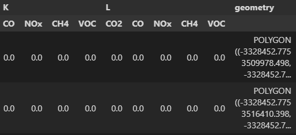
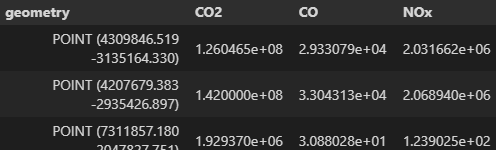

Implementing a new Inventory
============================

If you want to implement a new inventory, you may take the tno inventory
as an example, since it has an easy-to-understand implementation.

Inherit from the base class 
---------------------------

If you want to include a new inventory in emiproc, 
you should first create a class that inherits from 
:py:class:`~emiproc.inventories.Inventory` .

Create __init__ of the class 
----------------------------

Make sure your class is as easy as possible to use, such that 
for example you only need to specify the paths of the files.

If you have some parameter to choose (ex. Year of Inventory)
define them in the :py:meth:`__init__` method.

Fill data into the geodataframe 
-------------------------------

There are 2 possible ways of specifing emissions:

1. give emissions values for categories and substances on a grid 
2. give custom geometries (e.g. point or area sources) that emit some substance/category

emiproc can handle both simulatenously but it has to follow this pattern:

1. gridded emissions will be stored in a :py:mod:`geopandas.GeoDataFrame`  called `gdf`
2. custom geometries will be stored in a dictionary called `gdfs` 
   mapping categories to :py:mod:`geopandas.GeoDataFrame`

gdf 
^^^

Contains information on the grid including the coordinate reference system `crs`.
The geometry column contains all the grid cells (polygons) of the grid.

Other columns contain values for the emissions for each category/substance.
Columns are multi-index columns, with the first line containing the categories and second line 
the substances.

The len of gdf is the number of cells in the grid.

gdfs
^^^^
This is a python dict mapping the name of the category
to geodataframes.

For each dataframe, 
the geometry column contains all the custom geometries from that source category,
which can be points or polygons.

Other columns contain values for the emissions for each substance in that category.

The len of a gdfs is the number of source of the gdfs's category.

Add crs information
-------------------

When you create the gdf and gdfs, make sure you add 
the information about the crs directly in the gdf and gdfs.

Substances Names
----------------

emiproc requires all the inventories to have the exact same name for 
the substances in the gdf,
to allow the different utility functions to work correctly.

The following names already apply: 

* CO2
* CH4
* CO
* NOx
* NH3
* SO2
* N2O
* VOC
* F-gases
* PM10
* PM25
* PM10ex
* PM10non
* PM25ex
* PM25non
* benzene

In case your inventory contain substances that are not in this list,
you are welcome to add a new line to the list.

Categories Names
----------------

On the opposite of substances, the categories can be the same as the ones
from the raw data of the inventory.

emiproc provides tools for groupping the categories.
:py:func:`~emiproc.inventories.utils.group_categories`

Profiles 
--------

If your inventory contains profiles, you can add them in the Inventory.

One has to provide the profiles as 
:py:class:`~emiproc.profiles.vertical_profiles.TemporalProfile` and
:py:class:`~emiproc.profiles.vertical_profiles.VerticalProfiles` objects.

To specify which profile belongs to which categories and substances,
there is a xarray mapping. 

More information can be obtained in :ref:`profiles`.

Take care of correct units
---------------------------

By convention emiproc uses units :math:`\frac{kg}{y}` .
In particular, every emission value in the gdf and gdfs means
kg/y per geometry (== per grid cell in gdf). 
Note that one year corresponds to 365.25 days.

Some export functions will then convert automatically to the 
unit required when saving to file.
