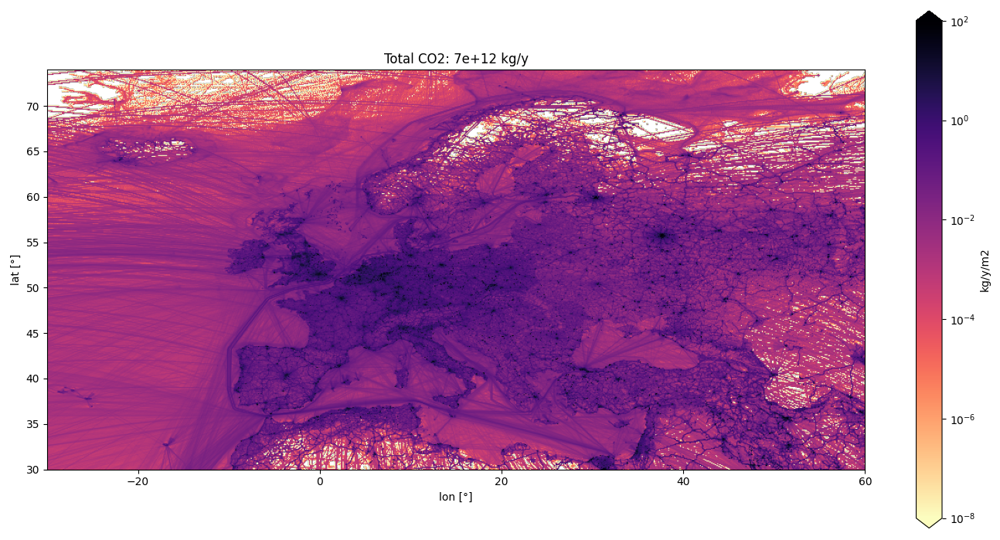

# Summary

Emission inventories are created by countries and regions to assess and address air quality and climate change targets.
An emission inventory is a spatial dataset that reports the yearly amount of pollutants released into the atmosphere, often broken down by specific source sectors or individual sources.
Atmospheric modellers use such inventories to simulate the transport of emitted species in order to compute their distribution and assess their potential impact on the environment.
The simulations are often compared with measurements to verify if the declared emissions and their trends are consistent with the observed changes in the atmosphere, thereby enhancing confidence in the inventories.

Figure \ref{fig:edgar} presents an example of a gridded inventory.

{ width=100% }

Inventories are created in multiple different formats and resolutions, which makes it difficult to compare and use them in atmospheric transport models.
For example, TNO (Dutch Organization for Applied Scientific Research) provides inventories which contains both, area emissions on a regular grid and point
sources at their exact locations.
Other inventories, such as one from the city of Zurich, are provided as 
vector data with various shapes (points, lines, polygons) depending on the category of the source.
Atmospheric models require emission inventories to be in a specific file format.
For example ICON-ART [@icon_art_2.1] requires emissions on a semi-structured triangular grid
and temporal profiles to scale the emissions with hourly, daily and monthly variability.

# Statement of need

`emiproc` is a Python package that provides tools for processing emission inventories, harmonizing datasets, and preparing such data as inputs for atmospheric transport models.
Designed to be flexible and extendable, `emiproc` allows users to easily add custom functionality, read new inventories or export data to other formats.

When modellers design their simulations, they are often interested in modifying the inventories.
For example, they could do the following: scale emissions based on future scenarios, aggregate emissions by sector or pollutant to simplify their simulations or combine multiple inventories to represent different sources such as anthropogenic and natural emissions.
`emiproc` provides this functionality and has already been successfully applied for different use cases:

* @acp-24-2759-2024 produced emission files for ICON-ART-OEM based on the EDGARv6
inventory [@edgar_v6] (Emissions Database for Global Atmospheric Research).

* @donmez2024urban conducted urban climate simulation using emissions produced 
with `emiproc` for cities of Zurich and Basel.

* @ponomarev2024estimation used `emiproc` to nest the Zurich city inventory
inside the Swiss national inventory and to further nest the Swiss inventory
inside the European TNO inventory.

`emiproc` shares some of its functionality with another Python tool, `HERMESv3` [@hermesv3_part1], which is also designed to process emission data and generate input files for atmospheric transport models.  
Compared to `HERMESv3`, which relies on specific configuration files, `emiproc` is more flexible, extensible and practical as it can be integrated in existing Python-based workflows.

# History

An earlier version of `emiproc` was already published by @gmd-13-2379-2020, but it was limited to specific models and inventories. 
Starting in 2022 `emiproc` has been refactored to satisfy the requirements of high flexibility and modularity.
This included major changes to code structure, the addition of new capabilities, a major performance increase for the task of spatial regridding, a comprehensive documentation and the addition of test examples.

Since then the package is regularly updated with new features and bug fixes.

# Design 

{ width=60% }

The API of `emiproc` leverages the advantages of object-oriented programming. 
The main class is `Inventory`. It provides a common data structure
to represent and harmonize all the different emission inventories.
The `Grid` object represent the spatial distribution of the emission.
It is flexible enough to implement all kinds of grids, from regular latitude-longitude grids
to the icosahedral grid from the ICON Model [@IconRelease01].
Finally `TemporalProfile` and `VerticalProfile` are used for the distribution of emissions 
in time and height.

Thanks to the harmonization of the data, functions for additional data processing
can easily be applied to the different inventories once loaded into `emiproc`. 
These functions are listed in the [API documentation](https://emiproc.readthedocs.io/en/master/api/index.html). 
Examples of operations on inventory data are among others:

* remapping to different model grids
* aggregating emissions by sector or pollutant
* crop an inventory over a specific area

`emiproc` also allows for generation of additional emission sectors not always present in the inventories.
For example, the vegetation emissions can be modelled through VPRM (Vegetation Photosynthesis and Respiration Model) [@vprm].

The export of inventories for various
atmospheric models is done through custom functions that produce all emission input files required by the
model. 

For data vizualisation `emiproc` provides custom functions based on `matplotlib` [@matplotlib].
Figure \ref{fig:edgar} was created using such a function.

`emiproc` is built on top of `geopandas` [@kelsey_jordahl_2020_3946761], 
which allows storing the geometries of the emission maps and offers many functionalities
related to geometric operations.
Within `emiproc`, the emission data of the inventory is stored as a
[`geopandas.GeoDataFrame`](https://geopandas.org/en/stable/docs/reference/geodataframe.html).

# Availability

The package is available on [GitHub](https://github.com/C2SM-RCM/emiproc)
and the documentation is available on [readthedocs](https://emiproc.readthedocs.io/).

[Tutorials](https://emiproc.readthedocs.io/en/master/tutos/tutorials.html)
are available to guide new users. 
A good first start is the
[EDGAR processing tutorial](https://emiproc.readthedocs.io/en/master/tutos/edgar_processing.html)
which shows how `emiproc` can be used to load, process and export a freely available inventory.

# Acknowledgements

We acknowledge all the previous and current contributers of emiproc:
Michael Jähn, Gerrit Kuhlmann, Qing Mu, Jean-Matthieu Haussaire, David Ochsner, Katherine Osterried, Valentin Clément, Alessandro Bigi.

We would like to thank Hugo Denier van der Gon and Jeroen Kuenen from TNO for their support for the integration of the latest TNO inventories and Tobias Kugler and Corinne Hörger from the city of Zurich for providing the detailed city inventory. 

We also acknowledge C2SM (Center for Climate Systems Modeling) for the development of the first version of `emiproc`.

Finally we would like to thank the developers of the Python packages used by `emiproc` and the whole Python community for providing such a great ecosystem.

# References
