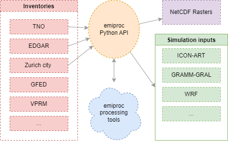

# Summary

In the effort to reduce air pollution and greenhouse gas concentrations, emission inventories
are created by countries and regions to estimate the magnitude of emissions and the share of individual source sectors.
Modellers use these inventories to simulate the transport and physical and chemical processing of the emitted substances to compute their distribution in the atmosphere. The simulations are then compared with measurements to control if the declared emissions and their trends are consistent with the observed changes in the atmosphere, establishing the correctness of the inventories.

Inventories are created in multiple different formats and resolutions, which makes it difficult to compare
and use them in atmospheric transport models.

Figure \ref{fig:tno} an example of a gridded inventory.

{ width=100% }

`emiproc` is a Python package that
provides tools for processing and harmonizing emission inventories and for generating emission input files for different atmospheric models. It includes functions for reading, writing, and exporting emission inventory data to various formats used in atmospheric transport models. `emiproc` also provides functions for performing various 
operations on inventory data, such as remapping emissions to different model grids including complex, semi-structured
grids, aggregating emissions by sector or pollutant, or scaling emissions based on projection scenarios. 

Emission input files can be generated in regular (e.g. hourly) intervals by applying sector-specific (and eventually country-specific) temporal and vertical emission profiles. Alternatively, a small set of input files can be generated, which describe the sectorial gridded emissions and their temporal and vertical profiles. This set of files can then be read by the online emissions module described by Jähn et al. (2020), which applied the temporal and vertical scaling online during the model simulation. 

The package is designed to be flexible and extendable, allowing users to easily add new functionality, to read new inventories or export data to new formats.

# Statement of need

Emission inventory data can be represented in various formats and resolutions. 
For example, TNO provides an inventory which contains both, a gridded map and point
sources. 
Other inventories, such as Mapluft (the inventory from the city of Zurich) are provided as 
GIS data with various shapes depending on the category of the emission source. As an 
example: 

* Traffic emissions are represented as lines
* Building/industry emissions are represented as point sources
* Private boats on the lake are represented as polygons

Air quality models usually require emission inventories to be in a specific format.
This is often due to the different functionalities these models have. For example,
ICON-ART-OEM requires emissions on the ICON triangular grid. It also requires cyclic time 
profiles for the emissions at daily, weekly and monthly resolutions.
On the other hand, the GRAL model can simulate, line, point or rectangular sources.
GRAL also needs very detailed information about the emissions, such as the height,
the temperature or the gas exit velocity of the source.

Moreover, when modellers design transport simulations, they often are interested in
modifying the inventories. For example, they may want to scale the emissions based on
different scenarios, or they may want to aggregate emissions by sector or pollutant.

`emiproc` has already been successfully applied for different use cases.

* [@acp-24-2759-2024] produced emission files for ICON-ART-OEM based on the EDGARv6
inventory [@edgar_v6].

* [@donmez2024urban] conducted urban climate simulation using emissions produced 
with `emiproc` for cities of zurich and basel.

* [@ponomarev2024estimation] used `emiproc` to nest the zurich city inventory
inside the swiss national inventory around the city boundary

Another python software, `HERMESv3` [@hermesv3_part1], can already process emission 
data and generate input files for athmospheric transport models. However, `HERMESv3` is
relying on specific configuration files. `emiproc` is much more flexible and extensible.
It is alsow easier to use at it can by integrated directly in python scripts.

# History

An older version of the `emiproc` package was already published [@gmd-13-2379-2020],
but it was written only for specific models and was not modular enough to easily account
for new inventories and models. `emiproc` was then refactored in 2022 to reach 
the new requirements. This included a major structure change, the addition of new
capabilities, a performance increase, a new documentation and a test coverage.

Since then the package is regularly updated with new features and bug fixes.

# Design 

To be able to use these different kind of inventories in air quality models, it is
necessary to harmonize them. This is what the `emiproc` package is designed for.

Thanks to the harmonization of the data, processing functions can be applied to the
different inventories once loaded into `emiproc`. They can later be exported to any
of the supported formats provided by the package.

The API of `emiproc` makes a great use of object-oriented programming. 

`emiproc` is built on top of ,the `geopandas` package [@kelsey_jordahl_2020_3946761], 
which allows storing the geometries of the emission maps and offers a lot of functionalities
related to geometric operations.
In the inventory, the emission data is stored as 
[`geopandas.GeoDataFrame`](https://geopandas.org/en/stable/docs/reference/geodataframe.html).

## Inventory
The main object
is the `Inventory` object. Any inventory is a subclass of the `Inventory` object.

`emiproc` provides many utility functions to process this basic object. 
Typically processing function take and inventory and some parameters as input and return a new Inventory object
with the processed data.

Example: the `group_categories` function converts an `Inventory` with some categories 
to a new `Inventory` with another set of categories, based on a mapping provided by the user. 
This is useful to reduce the number of categories simulated
and use a standardized set of categories such as the GNFR sectors from [@emep_guidelines].

## Grid
As inventories and models always come on different grids, `emiproc` uses a `Grid` object.
For many use cases the `RegularGrid` child class can be used,
but for specific models the user can define their own grid. 

Example: The ICON Model [@IconRelease01] is simulated over
an icosahedral (triangular) grid, for which `emiproc` provides an `ICON_grid` object.

Functions in `emiproc` can then perform various operations on these `Grid` objects 

Example: the `remap_inventory` function can be used to remap the emissions to a different grid.
The `remap_inventory` function takes an `Inventory` and a `Grid` as input, and returns a new
`Inventory` containing emissions remapped to the new grid.

## Temporal and vertical profiles

To handle the temporal distribution of the emissions, `emiproc` uses the
`TemporalProfile` object which are assigned to the `Inventory`. 
This object stores the temporal distribution of the emissions. 
Profiles can be either defined at specific datetimes 
or cyclic defined at different temporal resolutions (e.g. daily, weekly, monthly).

Vertical distribution of the emissions is handled in a similar manner by the 
`VerticalProfile` object. 

These profile objects can be assigned very specifically to certain types of emissions.
For example, it is possible to assign them to a specific
category / polluant / country / gridcell.

## Export functions

Finally, `emiproc` contains many functions to export inventories for various
air quality models. 
These export functions are designed to make life of the modellers
as simple as possible. 

Some transport model might require some additional data which is not 
given in the inventories. In this case, `emiproc` provides error messages which
guide the user into adding the missing data.

## Emissions generation 

Some emissions sectors are not provided in the inventory. For example, the
human respiration is rarely provided.  However, 
an emission map for this sector can be estimated based on the population density. 
For this purpose, `emiproc` provides a module that helps to calculate these emissions.

Another example is the emissions from vegetation. 
Different models can estimate the emissions from vegetation based on satellite
observations. `emiproc` implements the VPRM model [@vprm].

This topic is one for which the HERMES model is already well developed in 
its bottom-up part [@hermesv3_part2] as they implemented many sectors and polluants.

In the future, we hope users will contribute by adding new emission models.

## Visualizing the data
At the end of the processing, a modeller usually wants to check the output files 
to see if the processing was successful. 

For some of the outputs, emiproc provides example plot scripts based on matplotlib.

For regular grids, the `plot_inventory` function from the `emiproc.plots` module
can be used to plot the emissions on a map.
Figure \ref{fig:tno} was created using this function.

# Availability

The package is availabe on [GitHub](https://github.com/C2SM-RCM/emiproc)
and the documentation is available on [readthedocs](https://emiproc.readthedocs.io/en/latest/).

# Acknowledgements

We acknowledge all the previous and current contributers,
the developpers of all models and inventories included in
`emiproc` and the developpers of the packages used by `emiproc`.

# References
